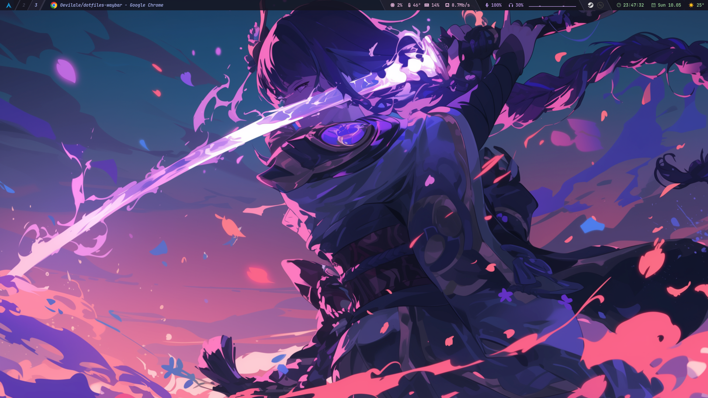

# Waybar Config

Configuración de Waybar para Hyprland, estilo minimalista con íconos Nerd Font y tema Catppuccin Mocha.

## Estructura

```
~/.config/waybar/
├── config.jsonc    # Configuración principal de módulos
├── style.css       # Tema Catppuccin Mocha con gradientes powerline
└── scripts/
    └── weather.sh  # Script de clima (3 días, emojis)
```

## Módulos

### Izquierda
- `custom/arch` — Logo de Arch Linux (ícono Nerd Font)
- `hyprland/workspaces` — Workspaces con íconos
- `hyprland/submap` — Indicador de submapa activo
- `hyprland/window` — Ventana activa con ícono

### Derecha
- CPU | Temperatura | RAM | Red | Audio In | Audio Out | Cava | Tray | Reloj | Clima

### Screenshots



## Características

- **Visualizador de audio**: `waybar-cava` v0.15.0 con captura PipeWire (headset G435)
- **Clima**: Script custom con pronóstico de 3 días (Night, Morning, Noon, Evening) y emojis
- **Fuente**: JetBrainsMono Nerd Font, 9pt
- **Transparencia**: 15% (`rgba(..., 0.85)`)
- **Layout**: Full-width, sin márgenes, pegado arriba
- **Tema**: Catppuccin Mocha con gradientes powerline

## Clima

El script `scripts/weather.sh` consulta `wttr.in` y muestra:
- Temperatura actual + sensación térmica
- Viento y humedad
- Pronóstico por períodos: 🌙 Night, 🌅 Morning, ☀️ Noon, 🌆 Evening
- Máximas y mínimas de cada día

## Dependencias

- `waybar-cava` (AUR) — fork de Waybar con módulo cava integrado
- `jq` — procesamiento JSON para el script de clima
- `curl` — consulta a wttr.in
- Font: `JetBrainsMono Nerd Font`

## Instalación

```bash
# Clonar
git clone git@github.com:0evilale/dotfiles-waybar.git ~/.config/waybar

# Instalar waybar-cava (AUR)
yay -S waybar-cava

# Iniciar
waybar &
```
